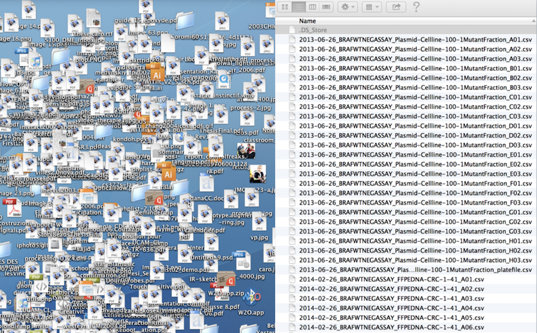
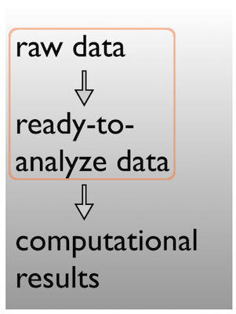
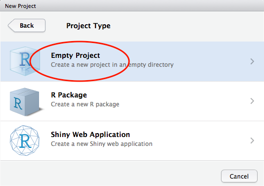
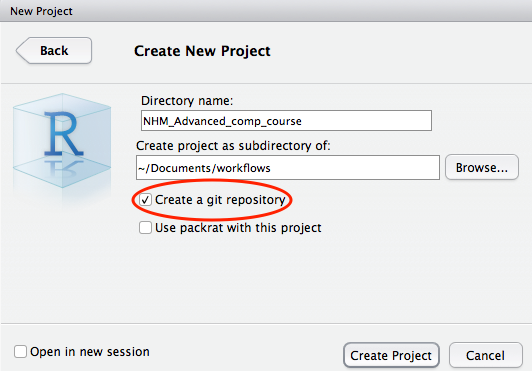
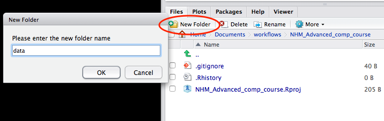

<script>window.twttr = (function(d, s, id) {
  var js, fjs = d.getElementsByTagName(s)[0],
    t = window.twttr || {};
  if (d.getElementById(id)) return t;
  js = d.createElement(s);
  js.id = id;
  js.src = "https://platform.twitter.com/widgets.js";
  fjs.parentNode.insertBefore(js, fjs);

  t._e = [];
  t.ready = function(f) {
    t._e.push(f);
  };

  return t;
}(document, "script", "twitter-wjs"));</script>

```{r, echo = F}

if(names(rmarkdown::metadata$output)[1] == "html_document"){
    hash <- "#"}
if(names(rmarkdown::metadata$output)[1] == "ioslides_presentation"){
    hash <- ""}
```

<br>

## **Session Outline**

### **Research Data Management**

- Basic Data Hygiene

- Metadata 

### **Project Management**

- File system organisation

- File naming


## **The grand vision**

> Hans Rosling on open data in 2006

<iframe width="470" height="250" src="https://goo.gl/ry6AiG" frameborder="0" allowfullscreen></iframe>

<p class="accent_border"><b>How do we get there?</p></b>

<br>


## **Getting a handle on our research materials**


## **21st Century Research meta-responsibilities**

Better digital curation of the workhorses of modern science: **code** & **data**

- accessible
- reusable
- searchable


## **Drivers of better digital management**

- Funders: value for money, impact, reputation
- Publishers: many now require code and data.
    + Specialist journals for **software** (e.g [Journal of Open Source Software](http://joss.theoj.org/) and **data** (e.g. [Scientific Data](https://www.nature.com/sdata/)) have emerged.
- Your wider scientific community
- PIs, Supervisors and immediate research group

### **Yourselves!**

### **be your own best friend:**

> **aim to create secure materials that are easy to use and REUSE**

# Resources

##

### **Nine simple ways to make it easier to (re)use your data**

<br>

We describe nine simple ways to make it easy to reuse the data that you share and also make it easier to work with it yourself. Our recommendations focus on making your data understandable, easy to analyze, and readily available to the wider community of scientists.

<br>


#### [download](http://ojs.library.queensu.ca/index.php/IEE/article/view/4608/4898)

<br>
<br>


##

### [storify](https://storify.com/tomjwebb/advice-on-research-data-management) by Tom Webb [\@tomjwebb](https://twitter.com/tomjwebb)

<br>


<br>
<br>

##

### [**Blog post**](https://dynamicecology.wordpress.com/2016/08/22/ten-commandments-for-good-data-management/) **by Dynamic ecology** [\@DynamicEcology](https://twitter.com/DynamicEcology)

<br>


<br>
<br>

##

### **Data carpentry**

- **Domain specific lessons available** [**free online**](http://www.datacarpentry.org/lessons/)
    + Ecology materials
    + Genomics materials
    + Geospatial data materials
    + Biology semester long materials
    
- **Look out for training sessions**


<center>

</center>

<br>
<br>

## 

### **Seek help from support teams**

Most university libraries have assistants dedicated to Research Data Management:

<blockquote class="twitter-tweet" data-conversation="none" data-lang="en"><p lang="en" dir="ltr"><a href="https://twitter.com/tomjwebb">@tomjwebb</a> <a href="https://twitter.com/ScientificData">@ScientificData</a> Talk to their librarian for data management strategies <a href="https://twitter.com/hashtag/datainfolit?src=hash">#datainfolit</a></p>&mdash; Yasmeen Shorish (@yasmeen_azadi) <a href="https://twitter.com/yasmeen_azadi/status/556129700129800192">January 16, 2015</a></blockquote>
<script async src="//platform.twitter.com/widgets.js" charset="utf-8"></script>

<br>
<br>


# Basic Data Hygiene

## **Plan your Research Data Management**

- **Start early**. Make an RDM plan before collecting data.
    - [**RDM checklist**](http://www.dcc.ac.uk/sites/default/files/documents/resource/DMP/DMP_Checklist_2013.pdf)

- Anticipate **data products** as part of your thesis **outputs**
- Think about what technologies to use

### **Take initiative & responsibility. Think long term**

<br>

<blockquote class="twitter-tweet" data-conversation="none" data-lang="en"><p lang="en" dir="ltr">Act as though every short term study will become a long term one <a href="https://twitter.com/tomjwebb">@tomjwebb</a>. Needs to be reproducible in 3, 20, 100 yrs</p>&mdash; oceans initiative (@oceansresearch) <a href="https://twitter.com/oceansresearch/status/556107891610894337">January 16, 2015</a></blockquote>
<script async src="//platform.twitter.com/widgets.js" charset="utf-8"></script>


<br>
<br>


## **Data entering**

### extreme but in many ways defendable

<blockquote class="twitter-tweet" data-conversation="none" data-lang="en"><p lang="en" dir="ltr"><a href="https://twitter.com/tomjwebb">@tomjwebb</a> stay away from excel at all costs?</p>&mdash; Timothée Poisot (@tpoi) <a href="https://twitter.com/tpoi/status/556107000950829056">January 16, 2015</a></blockquote>
<script async src="//platform.twitter.com/widgets.js" charset="utf-8"></script>

## **excel: `read only`**

<blockquote class="twitter-tweet" data-conversation="none" data-cards="hidden" data-lang="en"><p lang="en" dir="ltr"><a href="https://twitter.com/tomjwebb">@tomjwebb</a> <a href="https://twitter.com/tpoi">@tpoi</a> excel is fine for data entry. Just save in plain text format like csv. Some additional tips: <a href="https://t.co/8fUv9PyVjC">pic.twitter.com/8fUv9PyVjC</a></p>&mdash; Jaime Ashander (@jaimedash) <a href="https://twitter.com/jaimedash/status/556113131932381185">January 16, 2015</a></blockquote>
<script async src="//platform.twitter.com/widgets.js" charset="utf-8"></script>

<blockquote class="twitter-tweet" data-conversation="none" data-lang="en"><p lang="en" dir="ltr"><a href="https://twitter.com/jaimedash">@jaimedash</a> just don’t let excel anywhere near dates or times.  <a href="https://twitter.com/tomjwebb">@tomjwebb</a> <a href="https://twitter.com/tpoi">@tpoi</a> <a href="https://twitter.com/larysar">@larysar</a></p>&mdash; Dave Harris (@davidjayharris) <a href="https://twitter.com/davidjayharris/status/556126474550263809">January 16, 2015</a></blockquote>
<script async src="//platform.twitter.com/widgets.js" charset="utf-8"></script>

<br>

## **Databases: more robust**

- good qc and advisable for multiple contributors

<blockquote class="twitter-tweet" data-conversation="none" data-lang="en"><p lang="en" dir="ltr"><a href="https://twitter.com/tomjwebb">@tomjwebb</a> databases? <a href="https://twitter.com/swcarpentry">@swcarpentry</a> has a good course on SQLite</p>&mdash; Timothée Poisot (@tpoi) <a href="https://twitter.com/tpoi/status/556142573308608513">January 16, 2015</a></blockquote>
<script async src="//platform.twitter.com/widgets.js" charset="utf-8"></script>

<blockquote class="twitter-tweet" data-conversation="none" data-lang="en"><p lang="en" dir="ltr"><a href="https://twitter.com/tomjwebb">@tomjwebb</a> <a href="https://twitter.com/tpoi">@tpoi</a> if the data are moderately complex, or involve multiple people, best to set up a database with well designed entry form 1/2</p>&mdash; Luca Borger (@lucaborger) <a href="https://twitter.com/lucaborger/status/556226732496535552">January 16, 2015</a></blockquote>
<script async src="//platform.twitter.com/widgets.js" charset="utf-8"></script>


## **Databases: benefits** {.columns-2}

<blockquote class="twitter-tweet" data-conversation="none" data-lang="en"><p lang="en" dir="ltr"><a href="https://twitter.com/tomjwebb">@tomjwebb</a> Entering via a database management system (e.g., Access, Filemaker) can make entry easier &amp; help prevent data entry errors <a href="https://twitter.com/tpoi">@tpoi</a></p>&mdash; Ethan White (@ethanwhite) <a href="https://twitter.com/ethanwhite/status/556119480493813760">January 16, 2015</a></blockquote>
<script async src="//platform.twitter.com/widgets.js" charset="utf-8"></script>

<blockquote class="twitter-tweet" data-conversation="none" data-lang="en"><p lang="en" dir="ltr"><a href="https://twitter.com/tomjwebb">@tomjwebb</a> it also prevents a lot of different bad practices. It is possible to do some of this in Excel. <a href="https://twitter.com/tpoi">@tpoi</a></p>&mdash; Ethan White (@ethanwhite) <a href="https://twitter.com/ethanwhite/status/556119826582605824">January 16, 2015</a></blockquote>
<script async src="//platform.twitter.com/widgets.js" charset="utf-8"></script>

<br>
<br>
<br>


<blockquote class="twitter-tweet" data-conversation="none" data-lang="en"><p lang="en" dir="ltr"><a href="https://twitter.com/ethanwhite">@ethanwhite</a> +1 Enforcing data types, options from selection etc, just some useful things a DB gives you, if you turn them on <a href="https://twitter.com/tomjwebb">@tomjwebb</a> <a href="https://twitter.com/tpoi">@tpoi</a></p>&mdash; Gavin Simpson (@ucfagls) <a href="https://twitter.com/ucfagls/status/556120176748290048">January 16, 2015</a></blockquote>
<script async src="//platform.twitter.com/widgets.js" charset="utf-8"></script>


<br>

## **Data formats**

- **`.csv`**: *comma* separated values. 
- **`.tsv`**: *tab* separated values.
- **`.txt`**: no formatting specified.

<br>

<blockquote class="twitter-tweet" data-conversation="none" data-lang="en"><p lang="en" dir="ltr"><a href="https://twitter.com/tomjwebb">@tomjwebb</a> It has to be interoperability/openness - can I read your data with whatever I use, without having to convert it?</p>&mdash; Paul Swaddle (@paul_swaddle) <a href="https://twitter.com/paul_swaddle/status/556148166270406656">January 16, 2015</a></blockquote>
<script async src="//platform.twitter.com/widgets.js" charset="utf-8"></script>

> **more unusual formats will need instructions on use.**

<br>

## **Ensure data is machine readable**

### bad


##

### bad


##

### good 


##

### ok


- could help data entry
- `.csv` or `.tsv` copy would need to be saved.

<br>


## **Use good null values**

### Missing values are a fact of life

- Usually, best solution is to **leave blank**
- **`NA`** or **`NULL`** are also good options
- **NEVER use `0`**. Avoid numbers like **`-999`**
- Don’t make up your own code for missing values


<br>

## [**`read.csv()`**](http://stat.ethz.ch/R-manual/R-devel/library/utils/html/read.table.html) **utilities**

- **`na.string`:** character vector of values to be coded missing and replaced with `NA` to argument eg
- **`strip.white`:** Logical. if `TRUE` strips leading and trailing white space from unquoted character fields 
- **`blank.lines.skip`:** Logical: if `TRUE` blank lines in the input are ignored.
- **`fileEncoding`:** if you're getting funny characters, you probably need to specify the correct encoding.

```{r, eval=FALSE}
read.csv(file, na.strings = c("NA", "-999"), strip.white = TRUE, 
         blank.lines.skip = TRUE, fileEncoding = "mac")
```

<br>

## [**`readr::read_csv()`**](https://cran.r-project.org/web/packages/readr/readr.pdf) **utilities**

- **`na`:** character vector of values to be coded missing and replaced with `NA` to argument eg
- **`trim_ws`:** Logical. if `TRUE` strips leading and trailing white space from unquoted character fields 
- **`col_types`:** Allows for column data type specification. ([see more](https://cran.r-project.org/web/packages/readxl/vignettes/cell-and-column-types.html))
- **`locale`:** controls things like the default time zone, encoding, decimal mark, big mark, and day/month names
- **`skip`:** Number of lines to skip before reading data.
- **`n_max`:** Maximum number of records to read.

```{r, eval=FALSE}
read_csv(file, col_names = TRUE, col_types = NULL, locale = default_locale(), 
         na = c("", "NA", "-999"), trim_ws = TRUE, skip = 0, n_max = Inf)
```

<br>


## **Basic quality control**

#### Have a look at your data with `Viewer(df)`

<br>

- Check **empty cells**
- Check the **range of values** (and value types) in each column matches expectation. Use `summary(df)`
- Check **units of measurement**
- Check your **software interprets your data correctly** eg.   
    for a data frame `df`;
    - `head(df)` (see top few rows) and `str(df)` (see object structure) are useful.
- consider writing some **simple QA tests** (eg. checks against *number of dimensions*, *sum of numeric columns* etc)
<br>

## **Raw data are sacrosanct**

<blockquote class="twitter-tweet" data-conversation="none" data-lang="en"><p lang="en" dir="ltr"><a href="https://twitter.com/tomjwebb">@tomjwebb</a> don&#39;t, not even with a barge pole, not for one second, touch or otherwise edit the raw data files. Do any manipulations in script</p>&mdash; Gavin Simpson (@ucfagls) <a href="https://twitter.com/ucfagls/status/556107371634634755">January 16, 2015</a></blockquote>
<script async src="//platform.twitter.com/widgets.js" charset="utf-8"></script>

<blockquote class="twitter-tweet" data-conversation="none" data-lang="en"><p lang="en" dir="ltr"><a href="https://twitter.com/tomjwebb">@tomjwebb</a> <a href="https://twitter.com/srsupp">@srsupp</a> Keep one or a few good master data files (per data collection of interest), and code your formatting with good annotation.</p>&mdash; Desiree Narango (@DLNarango) <a href="https://twitter.com/DLNarango/status/556128407445323778">January 16, 2015</a></blockquote>
<script async src="//platform.twitter.com/widgets.js" charset="utf-8"></script>

<br>

## **Know your masters**

- identify the `master` copy of files
- keep it safe and and accessible
- consider version control
- consider centralising

<center>


source: http://www.thebugplanetstore.com/store/master-file/
</center>


<br>

## **Avoid catastrophe**

### Backup: on disk

- consider using backup software like [Time Machine](https://support.apple.com/en-gb/HT201250) (mac) or [File History](http://www.thundercloud.net/infoave/new/windows-10-has-a-time-machine/) (Windows 10)


### Backup: in the cloud

- dropbox, googledrive etc.
- if [installed](https://tools.google.com/dlpage/drive) on your system, can programmatically access them through `R`
- some version control

<blockquote class="twitter-tweet" data-conversation="none" data-lang="en"><p lang="en" dir="ltr"><a href="https://twitter.com/tomjwebb">@tomjwebb</a> Back it up</p>&mdash; Ben Bond-Lamberty (@BenBondLamberty) <a href="https://twitter.com/BenBondLamberty/status/556120946722222080">January 16, 2015</a></blockquote>
<script async src="//platform.twitter.com/widgets.js" charset="utf-8"></script>

<br>

## **Backup: the Open Science Framework** [osf.io](https://osf.io/)

- version controlled
- easily shareable
- works with other apps (eg googledrive, github)
- work on an interface with R ([OSFr](https://github.com/chartgerink/osfr)) is in progress. See more [here](https://youtu.be/cnE3AcdeGVY)

<br>


## **Backup: Github**

- most solid version control.

- keep everything in one project folder.

- Can be problematic with really large files.


# Metadata 

### Documenting your data


## You got data. Is it enough?

<blockquote class="twitter-tweet" data-conversation="none" data-lang="en"><p lang="en" dir="ltr"><a href="https://twitter.com/tomjwebb">@tomjwebb</a> I see tons of spreadsheets that i don&#39;t understand anything (or the stduent), making it really hard to share.</p>&mdash; Erika Berenguer (@Erika_Berenguer) <a href="https://twitter.com/Erika_Berenguer/status/556111838715580417">January 16, 2015</a></blockquote>
<script async src="//platform.twitter.com/widgets.js" charset="utf-8"></script>


<blockquote class="twitter-tweet" data-conversation="none" data-lang="en"><p lang="en" dir="ltr"><a href="https://twitter.com/tomjwebb">@tomjwebb</a> <a href="https://twitter.com/ScientificData">@ScientificData</a> &quot;Document. Everything.&quot; Data without documentation has no value.</p>&mdash; Sven Kochmann (@indianalytics) <a href="https://twitter.com/indianalytics/status/556120920881115136">January 16, 2015</a></blockquote>
<script async src="//platform.twitter.com/widgets.js" charset="utf-8"></script>

##

<blockquote class="twitter-tweet" data-conversation="none" data-lang="en"><p lang="it" dir="ltr"><a href="https://twitter.com/tomjwebb">@tomjwebb</a> Annotate, annotate, annotate!</p>&mdash; CanJFishAquaticSci (@cjfas) <a href="https://twitter.com/cjfas/status/556109252788379649">January 16, 2015</a></blockquote>
<script async src="//platform.twitter.com/widgets.js" charset="utf-8"></script>

<blockquote class="twitter-tweet" data-conversation="none" data-lang="en"><p lang="und" dir="ltr">Document all the metadata (including protocols).<a href="https://twitter.com/tomjwebb">@tomjwebb</a></p>&mdash; Ward Appeltans (@WrdAppltns) <a href="https://twitter.com/WrdAppltns/status/556108414955560961">January 16, 2015</a></blockquote>
<script async src="//platform.twitter.com/widgets.js" charset="utf-8"></script>

## 

<blockquote class="twitter-tweet" data-lang="en"><p lang="en" dir="ltr">You download a zip file of <a href="https://twitter.com/hashtag/OpenData?src=hash">#OpenData</a>. Apart from your data file(s), what else should it contain?</p>&mdash; Leigh Dodds (@ldodds) <a href="https://twitter.com/ldodds/status/828657155863638016">February 6, 2017</a></blockquote>
<script async src="//platform.twitter.com/widgets.js" charset="utf-8"></script>

<br>

## **#otherpeoplesdata dream match!**

### **Thought experiment: Imagine a dream open data set**

It's out there somewhere:

<center>

</center>

<br>

### **How would you locate it?**

- what details would you need to know to determine relevance? 
- what information would you need to know to use it?

<br>

<br>

## **metadata = data about data**

> ### Information that **describes, explains, locates**, or in some way makes it easier to **find, access**, and **use** a resource (in this case, data). 

<br>


source: http://chiphouston.com/wp-content/uploads/2016/06/who-what-when-where-and-why11.jpg

<br>

<br>


## **Data Reuse Checklist**

http://mozillascience.github.io/checklist/

<br>
<br>


<br>

## **Backbone of digital curation**


#### **Without it a digital resource may be irretrievable, unidentifiable or unusable**


### Descriptive

- *enables identification, location and retrieval of data, often includes use of controlled vocabularies for classification and indexing.*

### Technical

- *describes the technical processes used to produce, or required to use a digital data object.*

### Administrative

- *used to manage administrative aspects of the digital object e.g. intellectual property rights and acquisition.*


This usually takes the form of a structured set of elements. 

<br>

## **Elements of metadata**

- #### **Structured data files:**
    - readable by machines and humans, accessible through the web
- #### **Controlled vocabularies** eg. [NERC Vocabulary server](https://www.bodc.ac.uk/resources/products/web_services/vocab/)
    - allows for connectivity of data
    
### **KEY TO SEARCH FUNCTION**
- By structuring & adhering to controlled vocabularies, data can be combined, accessed and searched!
- Different communities develop different standards which define both the structure and content of metadata

<br>

## **Organising data and metadata**

- Start at the very least by **creating a metadata tab within your raw data spreadsheet**

<blockquote class="twitter-tweet" data-conversation="none" data-lang="en"><p lang="en" dir="ltr"><a href="https://twitter.com/tomjwebb">@tomjwebb</a> Create a tab on your excel sheet that explains exactly what you did to get each part of the data and how you have treat it so far.</p>&mdash; Erika Berenguer (@Erika_Berenguer) <a href="https://twitter.com/Erika_Berenguer/status/556109844659597312">January 16, 2015</a></blockquote>
<script async src="//platform.twitter.com/widgets.js" charset="utf-8"></script>

- Ensure everything someone might need to understand your data is documented
- Ideally set up a system of **normalised tables** [see section 3 in this post](https://dynamicecology.wordpress.com/2016/08/22/ten-commandments-for-good-data-management/) and **`README`** documents to manage and document metadata.
- **Different types data require different metadata**

- When you're ready to publish, structure metadata into an [**`XML`**](https://en.wikipedia.org/wiki/XML) file, a **searchable, shareable file**.

## **Make your data alignable and generalisable**

What information would other users require to combine your data with theirs?

- time `temporal (time of day, day, month, year, season)`
- space `geography (lat, lon, postcode)`
- taxonomy `species name; authority / source`
- provide information on **extent** and **resolution**

<blockquote class="twitter-tweet" data-conversation="none" data-lang="en"><p lang="en" dir="ltr"><a href="https://twitter.com/tomjwebb">@tomjwebb</a> record every detail about how/where/why it is collected</p>&mdash; Sal Keith (@Sal_Keith) <a href="https://twitter.com/Sal_Keith/status/556110605053349888">January 16, 2015</a></blockquote>
<script async src="//platform.twitter.com/widgets.js" charset="utf-8"></script>

<br>

<br>

# Example metadata structure

## **Bird Trait Networks dataset**

<br> 

- I'm using data from a project in which we ***compiled large dataset on bird reproductive, morphological, physiological, life history and ecological traits across as many bird species as possible*** to perform a network analysis on associations between trait pairs.

- I'll use a simplified subset of the data to show a **simple metadata (attribute) structure** that can easily form the basis of a more formal [**EML**](https://en.wikipedia.org/wiki/Ecological_Metadata_Language) (ecological XML) using function in the package [EML](https://cran.r-project.org/web/packages/EML/vignettes/creating-EML.html)


```{r, message=FALSE, echo=F}
options(stringsAsFactors = FALSE)

knitr::opts_chunk$set(warning=FALSE, message=FALSE)

### SETTINGS ##############################################################
input.folder <- "assets/data/"

### FILES #################################################################

attr_tbl <- read.csv(paste("assets/data/","attr_tbl.csv", sep =""), stringsAsFactors = F)
dt   <- read.csv(paste("assets/data/","bird_trait_db-v0.1.csv", sep =""))


### PACKAGES #################################################################

require(knitr)
library(tibble)

```

<br>

## data 

```{r, echo=FALSE}
kable(head(as_data_frame(dt), 9), caption = "bird trait networks dataTable")
```

- Like many real data sets, column headings are convenient for data entry and manipulation, but **not particularly descriptive to a user not already familiar with this data**. 

- More importantly, they **don't let us know what units they are measured in** (or in the case of categorical / factor data like species names or life stages, **what the factor abbreviations refer to**). So let us take a moment to be more explicit:

## make an attribute table

I use functions in [**`eml_utils.R`**](https://github.com/annakrystalli/ACCE_RDM/blob/master/R/eml_utils.R) to:

- create an `attr_tbl` in which to complete all info required
- to extract elements from `attr_tbl` to supply to EML generating functions.

```{r, eval=FALSE}
library(RCurl)
eval(parse(text = getURL(
    "https://raw.githubusercontent.com/annakrystalli/ACCE_RDM/master/R/eml_utils.R", 
    ssl.verifypeer = FALSE)))
```

```{r, echo = FALSE}
library(RCurl)
eval(parse(text = getURL(
    "https://raw.githubusercontent.com/annakrystalli/ACCE_RDM/master/R/eml_utils.R", 
    ssl.verifypeer = FALSE)), envir = environment())
```

<br>

## create `attr_tbl` shell

- #### load data
```{r, eval=FALSE}
dt   <- read.csv("data/bird_trait_db-v0.1.csv")
```


- #### create `attr_tbl` shell from **your data (`dt`)** 
    - use function `get_attr_shell` from `eml_utils.R`.

```{r}
attr_shell <- get_attr_shell(dt)
str(attr_shell)
```

## `attributes` df columns

I use recognized column headers shown here to make it easier to create an EML object down the line. I focus on the core columns required but you can add additional ones for your own purposes.
Attributes associated with all variables: 

- attributeName (required, free text field) 
- attributeDefinition (required, free text field)
- columnClasses (required, `"numeric"`, `"character"`, `"factor"`, `"ordered"`, 
    or `"Date"`, case sensitive)

<br>

#### `columnClasses` dependant attributes  

- For `numeric` (ratio or interval) data:
    - unit (required, see [eml-unitTypeDefinitions](https://knb.ecoinformatics.org/#external//emlparser/docs/eml-2.1.1/./eml-unitTypeDefinitions.html) and [working with units](https://github.com/ropensci/EML/blob/master/vignettes/working-with-units.Rmd))
- For `character` (textDomain) data: 
    - definition (required)
- For `dateTime` data: 
    - formatString (required)
    e.g for date `11-03-2001` formatString would be `"DD-MM-YYYY"`
<br>

- I use the columns `code` and `levels` to store information on factors. Use `";"` to separate code and level descriptions. These can be extracted by `eml_utils.R` function `get_attr_factors()` later on.


## complete `attr_tbl`

#### save shell
- write `attr_shell` to `.csv`

```{r, eval=FALSE}
write.csv(attr_shell, file = "data/attr_shell.csv")
```
<br>

#### complete attr_tbl
- complete in excel and save to **attr_tbl.csv**
- read in completed **attr_tbl.csv**

```{r, eval=FALSE}
attr_tbl <- read.csv(file = "data/attr_tbl.csv")
```

<br>

## `attr_tbl`
```{r, echo = F}
if(names(rmarkdown::metadata$output)[1] == "html_document"){
kable(head(attr_tbl, 9), caption = "table 2. bird trait networks attr_tbl")}

if(names(rmarkdown::metadata$output)[1] == "ioslides_presentation"){
kable(head(attr_tbl[1:7], 9), caption = "table 2a. bird trait networks attr_tbl")}

```

##

```{r, echo = F}
if(names(rmarkdown::metadata$output)[1] == "ioslides_presentation"){
kable(head(attr_tbl[c(1,8:11)], 9), caption = "table 2b. bird trait networks attr_tbl")}

```


          
## attributesList structure

### we need to supply two `data.frames`

- #### `attributes`
- #### `factors`

and a vector of:

- #### `columnClass`

<br>


<br>


## make `attributes` df
```{r}
attributes <- extract_attr_tbl(attr_tbl)
str(attributes, max.level = 2)
```

## make `factors` df

```{r}
factors <- get_attr_factors(attr_tbl)
kable(head(factors, 9))
```
formation by creating EML files and explicity supply variable descriptions and units.</b></p>


# Project Organisation

## from raw to analytical data

### [the reproducible pipeline](https://dynamicecology.wordpress.com/2016/08/22/ten-commandments-for-good-data-management/)
<p class="accent_border"><b>Do not manually edit raw data</b></p>

<p class="accent_border"><b>Keep a clean pipeline of data processing from raw to analytical.</b></p>


- Ideally, incorporate checks to ensure correct processing of data through to analytical.
- Clearly document any processing.
    - Well-commented script-based manipulation (e.g. in R) makes this easy
  
<br>

## automated == reproducible

<iframe width="560" height="315" src="https://www.youtube.com/embed/s3JldKoA0zw" frameborder="0" allowfullscreen></iframe>

<br>


## HOW?

### Let's face it...

- There are going to be files

- **LOTS** of files

- The files will **change over time**

- The files will **have relationships to each other**

### It'll probably get complicated

## Strategy against chaos

### **File organization** and **naming** is a mighty weapon against chaos

- Make a file's **name** and **location** ***VERY INFORMATIVE*** about:
    - what it is, 
    - why it exists, 
    - how it relates to other things

- The more things are **self-explanatory**, the better

- **READMEs** are great, but don't document something if you could just make that thing self-documenting by definition

# File system organisation

## {.flexbox .vcenter}

<center>
> ### A place for everything, everything in its place.
</center>

<br>

Benjamin Franklin

## {.flexbox .vcenter}



## use R projects

### Keep your work [tidy and self-contained](https://nicercode.github.io/blog/2013-04-05-projects/)


## Data analysis workflow {.flexbox .vcenter}


#### use sensible / standardised file system structure


source: https://nicercode.github.io/blog/2013-04-05-projects/

<br>

## Raw data $\rightarrow$ data

Pick a strategy, any strategy, just pick one!

<div class="columns-2">


~~~
data/
data-raw
data-clean

data/
  - raw/
  - clean/
~~~
</div>

## Data $\rightarrow$ results

Pick a strategy, any strategy, just pick one!

<div class="columns-2">


~~~
R

code

scripts

analysis

bin
~~~
</div>

# A real (and imperfect!) example

##

~~~
  /Users/jenny/research/bohlmann/White_Pine_Weevil_DE:
  total used in directory 246648 available 131544558
  drwxr-xr-x  14 jenny  staff        476 Jun 23  2014 .
  drwxr-xr-x   4 jenny  staff        136 Jun 23  2014 ..
  -rw-r--r--@  1 jenny  staff      15364 Apr 23 10:19 .DS_Store
  -rw-r--r--   1 jenny  staff  126231190 Jun 23  2014 .RData
  -rw-r--r--   1 jenny  staff      19148 Jun 23  2014 .Rhistory
  drwxr-xr-x   3 jenny  staff        102 May 16  2014 .Rproj.user
  drwxr-xr-x  17 jenny  staff        578 Apr 29 10:20 .git
  -rw-r--r--   1 jenny  staff         50 May 30  2014 .gitignore
  -rw-r--r--   1 jenny  staff       1003 Jun 23  2014 README.md
  -rw-r--r--   1 jenny  staff        205 Jun  3  2014 White_Pine_Weevil_DE.Rproj
  drwxr-xr-x  20 jenny  staff        680 Apr 14 15:44 analysis/
  drwxr-xr-x   7 jenny  staff        238 Jun  3  2014 data/
  drwxr-xr-x  22 jenny  staff        748 Jun 23  2014 model-exposition/
  drwxr-xr-x   4 jenny  staff        136 Jun  3  2014 results/
~~~

## Data

Ready to **analyze data**:


<hr>

**Raw data**:


## Analysis and figures

**`R` scripts** + the **Markdown** files:


<hr>

The **figures created in those `R` scripts** and **linked in those Markdown files**:


## Scripts

**Linear progression of R scripts**, and **Makefile** to run the entire analysis:


## Results

**Tab-delimited files** with one row per gene of parameter estimates, test statistics, etc.:


## Expository files

Files to **help collaborators understand the model we fit:** some markdown docs, a Keynote presentation, Keynote slides exported as PNGs for viewability on GitHub:


## Caveats / problems with this example

- This project is **nowhere near done**, i.e. *no manuscript or publication-ready figs*

- **File naming has inconsistencies** due to three different people being involved

- **Code and reports/figures all sit together** because it’s just much easier that way w/ `knitr` & `rmarkdown`

## Wins of this example

- Someone can walk away from the project and **come back to it a year later and resume work** fairly quickly

- **Collaborators** (the two other people, the post-doc whose project it is + the bioinformatician for that lab) were able to figure out what I did and decide which files they needed to look at, etc.

<center>
<b>GOOD ENOUGH!</b>
</center>

# Other tips


## Evolution of your file system

- **Be consistent** – when developing a naming scheme for folders it is important that once you have decided on a method, you stick to it. If you can, try to agree on a naming scheme from the outset of your research project

- **Structure folders hierarchically**: 
        - start with a limited number of folders for the broader topics 
        - create more specific folders within these
        
- **Separate ongoing and completed work**: as you start to create lots of folders and files, it is a good idea to think about separating older documents from those you are currently working on 


## The `from_joe` directory

- Let's say my collaborator and data producer is Joe. 

- He will send me data with weird space-containing file names, data in Microsoft Excel workbooks, etc. 

- It is **futile to fight this**, just **quarantine all the crazy in a `from_joe` directory**. Then **rename** things and/or **export to plain text** and **put those files in your data directory**. 

- **Record whatever you do you do to those inputs in a README or in comments in your R code** -- whatever makes it easiest to remind yourself of a file's provenance, if it came from the outside world in a state that was not ready for programmatic analysis.

## Give yourself less rope

- It's a good idea to **revoke your own write permission to the raw data file**.

- Then you **can't accidentally edit it**.

- It also makes it **harder to do manual edits** in a moment of weakness, when you know you should **just add a line to your data cleaning script**.

## Prose

- Sometimes you need a place to park key emails, internal documentation and explanations, random Word and PowerPoint docs people send, etc.

- This is kind of like `from_joe`, where I don’t force myself to keep same standards with respect to file names and open formats.

## Recap

> File organization should **reflect inputs vs outputs** and the **flow of information**

~~~
/Users/jenny/research/bohlmann/White_Pine_Weevil_DE:
drwxr-xr-x  20 jenny  staff        680 Apr 14 15:44 analysis
drwxr-xr-x   7 jenny  staff        238 Jun  3  2014 data
drwxr-xr-x  22 jenny  staff        748 Jun 23  2014 model-exposition
drwxr-xr-x   4 jenny  staff        136 Jun  3  2014 results
~~~

<center>

</center>


## Prepare data $\rightarrow$ Do stats $\rightarrow$ Make tables & figs

#### **The `R` scripts:**

~~~
01_marshal-data.r
02_pre-dea-filtering.r
03_dea-with-limma-voom.r
04_explore-dea-results.r
90_limma-model-term-name-fiasco.r
~~~

<hr>

#### **The figures left behind:**

~~~
02_pre-dea-filtering-preDE-filtering.png
03-dea-with-limma-voom-voom-plot.png
04_explore-dea-results-focus-term-adjusted-p-values1.png
04_explore-dea-results-focus-term-adjusted-p-values2.png
...
90_limma-model-term-name-fiasco-first-voom.png
90_limma-model-term-name-fiasco-second-voom.png
~~~


# File naming


## Names matter


## What works, what doesn't?

**NO**

~~~
myabstract.docx
Joe’s Filenames Use Spaces and Punctuation.xlsx
figure 1.png
fig 2.png
JW7d^(2sl@deletethisandyourcareerisoverWx2*.txt
~~~

**YES**

~~~
2014-06-08_abstract-for-sla.docx
joes-filenames-are-getting-better.xlsx
fig01_scatterplot-talk-length-vs-interest.png
fig02_histogram-talk-attendance.png
1986-01-28_raw-data-from-challenger-o-rings.txt
~~~

## Three principles for (file) names

#### **1. Machine readable**

#### **2. Human readable**

#### **3. Plays well with default ordering**

## Awesome file names :)


## Machine readable

#### **- Regular expression and globbing friendly**
 + Avoid spaces, punctuation, accented characters, case sensitivity

#### **- Easy to compute on**
 + Deliberate use of delimiters
    
## [Globbing](http://searchsecurity.techtarget.com/definition/globbing)

**Excerpt of complete file listing:**


**Example of globbing to narrow file listing:**


## Same using Mac OS Finder search facilities

<center>

</center>

## Same using regex in R

<center>

</center>

## Punctuation {.smaller}

#### **Deliberate use of `"-"` and `"_"` allows recovery of meta-data from the filenames:**

- `"_"` underscore used to delimit units of meta-data I want later
- `"-"` hyphen used to delimit words so my eyes don't bleed

<center>

</center>

<hr>

<center>

</center>

This happens to be R but also possible in the `shell`, `Python`, etc.

## Include important metadata

e.g. I'm saving a number of files of extracted environmental data at different resolutions (`res`) and for a number of months (`month`).


```{r, eval=FALSE}
write.csv(df, paste("variable_", res, month, sep ="_"))

df <- read.csv(paste("variable_", res, month, sep ="_"))
```


<br>


## Recap: machine readable

#### **- Easy to search for files later**

#### **- Easy to narrow file lists based on names**

#### **- Easy to extract info from file names, e.g. by splitting**

#### **- New to regular expressions and globbing? be kind to yourself and avoid**
 + Spaces in file names
 + Punctuation
 + Accented characters


    
# Human readable

## Human readable

#### **- Name contains info on content**

#### **- Connects to concept of a [*slug*](https://en.wikipedia.org/wiki/Semantic_URL#Slug) from semantic URLs**

## Example

**Which set of file(name)s do you want at 3 a.m. before a deadline?**


## Embrace the slug

<div class="columns-2">


</div>

## Recap: Human readable

Easy to figure out what the heck something is, based on its name

# Plays well with default ordering

## Plays well with default ordering

#### **- Put something numeric first**

#### **- Use the ISO 8601 standard for dates**

#### **- Left pad other numbers with zeros**

## Examples

**Chronological order:**


<hr>

**Logical order:** Put something numeric first


## Dates

Use the **ISO 8601** standard for dates: `YYYY-MM-DD`


##

<center>

</center>


## Left pad other numbers with zeros

<center>

</center>

<br>

**If you don’t left pad, you get this:**

~~~
10_final-figs-for-publication.R
1_data-cleaning.R
2_fit-model.R
~~~

which is just sad :(

## Recap: Plays well with default ordering

- Put something numeric first

- Use the ISO 8601 standard for dates

- Left pad other numbers with zeros

## Recap

## Three principles for (file) names

1. Machine readable

2. Human readable

3. Plays well with default ordering

## Pros

- Easy to implement NOW

- Payoffs accumulate as your skills evolve and projects get more complex

## Go forth and use awesome file names :)


<br>


# Let's set up our project!


## Activity

#### **- Create an project in which we will work this week**
#### **- Create a `data` folder**

## Creating an RStudio project

**File** -> **New Project** -> **New Directory**


In the **Project Type** screen, click on **Empty Project**.



In the **Create New Project** screen, give your project a name and ensure that **create a git repository** is checked. Click on **Create Project**.



RStudio will create a new folder containing an empty project and set R's working directory to within it.

Two files are created in the otherwise empty project:-

* **.gitignore** - Specifies files that should be ignored by the version control system.
* **NHM_Advanced_comp_course.Rproj** - Configuration information for the RStudio project

There is no need to worry about the contents of either of these for now.

#### **Create a data folder**



#### **Success!**


